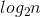

# Notes for 01_binary_search

1. **二分查找**(binary search)算法:输入是一个有序列表，如果查找元素包含其中，则返回其位置；否则，返回null。**简单查找**则是从第一个序号开始往后比较。
2. 对于包含*n*个元素的列表，用二分查找最多需要 步(对数时间)，而简单查找最多需要*n*步(线性时间)。
3. 大O表示法让我们可以比较操作数，也展示了算法运行时间随列表长度的增速。
4. 大O表示法说的是最糟的情形。
5. 旅行商问题的时间复杂度是*O(n!)*(阶乘时间)。
