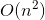

# Notes for 02_selection_sort

## 数组和链表

1. **数组**占用地址连续的内存单元，内存大小需要事先决定。
2. **链表**中每个元素都存储下一个元素的内存地址，将一系列随机的内存单元穿在一起。
3. 链表只支持顺序访问，而数组支持随机访问。
4. 要进行增删操作，链表是更好的选择；要读取速度快，数组更合适。

## 选择排序

1. **选择排序**算法:每次遍历数组找到其中的最小值，添加到一个新数组中，从而形成一个有序排列的新数组。
2. 选择排序时间复杂度为。
