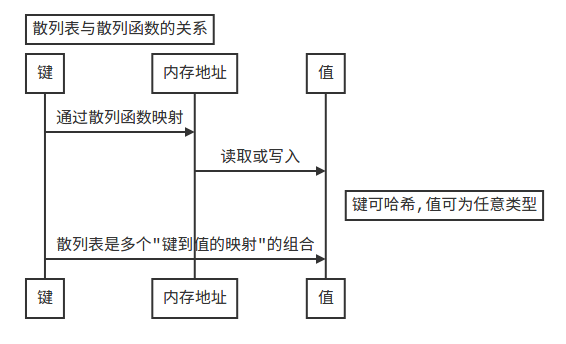

# Notes for 05_hash_tables

## 散列表

1. 散列函数是"将输入映射到数字"的函数。它满足：
   + 相同的输入必须有相同的输出。
   + 应将不同的输入映射到不同的数字(输入不同，输出数字就不同**是理想状况**！！)。
2. **散列表**(hash table)是结合了散列函数和数组的数据结构，它利用散列函数来确定元素的存储位置。工作原理是：
   + 散列函数将相同的输入映射到相同的索引。
   + 散列函数将不同的输入映射到不同的输出。
   + 散列函数知道数组有多大，只返回有效索引。

3. 散列表也被称为散列映射、映射、字典和关联数组。在python中的实现叫**字典**，即，散列表是键值对集合,将键映射到值。
4. 散列函数将键映射到内存位置，散列表将键映射到值。**注意**：值不一定是数字，而可以是各种数据类型。

5. 散列表是提供DNS解析(域名映射到IP地址)功能的方式之一。
6. 散列表适用于：
   + 模拟映射关系，如DNS解析；
   + 防止重复；
   + 缓存(记住数据)，以免服务器需要再次处理生成，即URL映射到缓存的页面数据。

## 冲突

1. 冲突(collision)：不同的键映射到相同的内存。
2. 解决冲突的最简单办法是：如果多个键映射到同一个位置，就在此位置存储链表。
3. **散列函数很重要**，理想情况是散列函数将键均匀地映射到散列表的不同位置。这样，存储的链表也不会很长，不过分影响读取速度。好的散列函数很少导致冲突。
4. **平均情况**(不同键分配不同内存)下，散列表执行各种操作(查找、插入、删除)的时间是*O(1)*(常量时间,*c\*1*)，意味着不管散列表多大，执行时间都一样。**最糟情况**(所有键都分配到同一内存组成链表)下，散列表执行各种操作的运行时间是*O(n)*(线性时间)。
5. 要避开最糟情况，应尽量避免冲突。

## 避免冲突

1. 避免冲突需要满足：
   + 较低的填装因子；
   + 良好的散列函数；
2. 填装因子 = 散列表包含的元素个数 / 位置总数
3. 一个不错的经验:一旦填装因子大于0.7，就需要在散列表中添加位置，即调整长度(resizing)。调整长度开销很大，不要频繁这样做。
4. 良好的散列函数使数组中的值呈均匀分布(SHA是一个良好的散列函数)。
