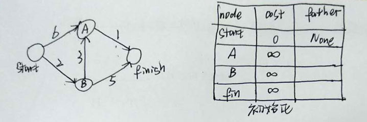
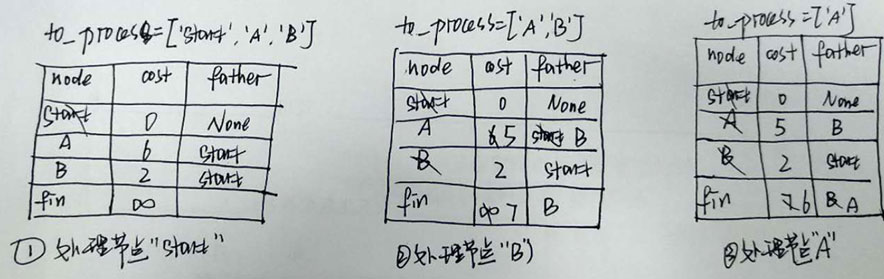

# Notes for 07_dijkstras_algorithm

## 基本原理

1. 广度优先搜索，适用于*非加权图*(unweighted graph)，找到的*最短路径*是段数最少的路径。**迪克斯特拉**(Dijkstras)算法，适用于*加权图*(weighted graph)，找出的是总权重最小的路径。
2. Dijsktra算法包含四个步骤：
   1. 找出当前离起点最近的节点；
   2. 对于该节点的邻居，检查是否有前往它们的更短路径，如果有，就更新其开销，并更新邻居的父节点；
   3. 重复这个过程，直到对所有节点都这样做了；
   4. 计算最终路径(路线和开销)。
3. Dijstras的基本思想：对于处理的节点，已经找到到它们的最短路径(或没有到达它们的更短路径)。
4. 以下图题目为例:
   

   利用算法求最短路径的求解过程如下：

   

   于是最终得到的最短路径`start--> B--> A--> fin`,开销为6。

## 算法实现
1. 节点的开销应初始化为无穷大,保证只要有路线可达，其开销一定能被更新。Python中是`float('inf')`。
2. 加权有向图仍然是散列表实现。
3. 求解全过程要用到：
   - 有向图散列表；
   - 开销散列表;
   - 父节点散列表;
   - 待处理节点列表(或已处理节点列表)。
4. 对`fin`终点不需要进行Dijkstras算法。

## 适用范围
1. 首先，Dijkstras算法适用于有向加权图。
2. 对于*有向无环图*(directed acyclic graph, DAG)也是适用的，因为Dijkstras算法会自动淘汰含有环的边。
3. **不适用**含负权边的有向图，负权边会在节点检查过之后仍然更新其开销，不符合Dijkstras算法的基本思想。在包含负权边的图中找最短路径要用另一种算法——Bellman-Ford算法。

