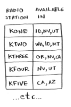
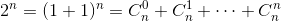

# Notes for 08_greedy_algorithms

## 贪婪算法
1. 贪婪算法(greedy algorithms)：每一步都采取最优的做法，希望每一步都采取局部最优解，从而得到全局最优解的算法。
2. 贪婪算法是一种近似算法(approximation algorithm)。在获得精确解需要时间太长时，可使用近似算法。
3. 贪心算法并不总是有效，但是易于实现。判断近似算法优劣的标准：
   - 速度有多快;
   - 近似解和最优解的接近程度。
4. 广度优先算法和Dijkstras算法都是贪婪算法。

## 集合覆盖问题
1. 举例如下图，要找到覆盖所有州的最少的广播站组合，这就是一个集合覆盖问题。

2. 上述问题的解有个。这被称为**幂集**(power set)。
3. 贪婪算法的解决思路是：每次选择能覆盖最多未覆盖区域的广播站，直到覆盖所有州。
4. 这个例子中的贪婪算法的运行时间为，其中*n*为广播台数量。也很好理解，大循环数 x 小循环数。

## NP完全问题
1. 旅行商问题和集合覆盖都是**NP完全问题**：需要计算所有的解，并从中选取最优的那个。
2. NP完全问题还没有找到快速的解决方法，使用近似算法是最好的方案。贪婪算法是不错的近似算法。
3. 旅行商问题(经过n个指定点的最短路径)的解法就是：每次选取没去过的最近的城市，直到没有城市没去过。
4. 判断是否NP完全问题很难。以下提供一些可以用于判断NP完全问题的线索：
   - 元素较少时算法运行速度快，随元素的增加，运行速度会变得非常慢;
   - 要利用"所有组合"来求解的问题通常是NP完全问题;
   - 不能分解成小问题，必须考虑各种可能情况，可能是NP完全问题;
   - 如果问题涉及序列(旅行商中的城市序列)且难以解决，可能是NP完全问题;
   - 如果问题涉及集合(广播台中的集合)且难以解决，可能是NP完全问题;
   - 如果问题可转为*旅行商问题*和*集合覆盖问题*，那一定是NP完全问题。
